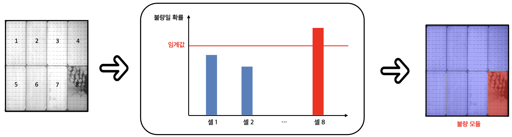
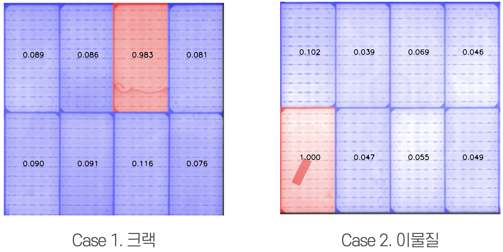
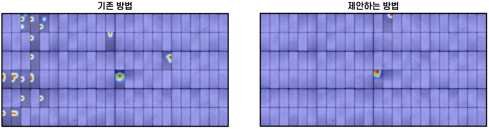

# 태양광 모듈 불량 자동 탐지 프로젝트
태양광 모듈 내 불량을 셀 단위로 자동 탐지 합니다.

## 사용 기술
### 개발 환경
- numpy==1.24.3
- torch==1.12.1
- torchvision==0.13.1

### 프로세스 도식화

## 코드 실행

    sh run.sh

## 결과
### 케이스 별 불량 탐지 결과

### GradCAM

